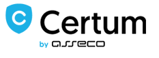

# OptiKey

OptiKey is an assistive on-screen keyboard which runs on Windows. It is designed to be used with an eye-tracking device to bring keyboard control, mouse control and speech to people with motor and speech limitations, such as people living with Amyotrophic Lateral Sclerosis (ALS) / Motor Neuron Disease (MND).

It works out of the box once you have your eye-tracking device installed and allows selections to be made using dwell selection, buttons, etc. If you do not have an eye tracking device you can use OptiKey with a mouse.

OptiKey was written to challenge the outrageously expensive, unreliable and difficult to use AAC (alternative and augmentative communication) products on the market. It is, therefore, fully open-source and free. Forever.

## General details about the project: 
* Homepage: [OptiKey Homepage](https://github.com/OptiKey/OptiKey/wiki)
* Repository: [OptiKey Repository](https://github.com/OptiKey/OptiKey)
* Development team: Julius Sweetland: 
  * [Email](mailto:optikeyfeedback@gmail.com)
  * [LinkedIn](https://uk.linkedin.com/in/julius-sweetland-73697756)
* Communications:
  * For Users: [optikeyfeedback@gmail.com](mailto:optikeyfeedback@gmail.com)
  * For Developments: [GitHub issue tracker](https://github.com/JuliusSweetland/OptiKey/issues)

## project fit for our book (or why it was chosen?) 
As a team we decided to choose a small and smart startup with social contribute and has a massive support from people around the web. This project appears to help people with disabilities and have a good cause and we liked it.
It also appears to be a promising project which have a great future in the startup industry and health industry .

## Describe the model of the development process:
This is an open source project and I would love for there to be a community of volunteers around OptiKey. I have a list the length of my arm with ideas, features and improvements. Here's a sample;

Add support for more languages (dictionaries, as well as localising OptiKey)
Add next word suggestions
Support for accessible buttons, sip/puff tubes, brain potential detection, and lots of other human interfaces
and lots more...
If you are interested in helping to push this project forward please email me at [optikeyfeedback@gmail.com](optikeyfeedback@gmail.com), or if you are a software dev please take a look at the current set of issues on the [GitHub issue tracker](https://github.com/JuliusSweetland/OptiKey/issues).

## Availaibe resources  Review
OptiKey uses a Low cost certificate for Open Source projects from www.certum.eu wich is one of the main resource available for quick and low cost for a customers production key and certificat .

<!-- -->

OptiKey is allso guided by MSDN user guide and followed by the Microsoft standrats for developing and deployment by .Net framework 4.5 followed by the link attached here :
[MSDN developer deployment guide](http://msdn.microsoft.com/en-us/library/ee942965%28v=vs.110%29.aspx)

Hardware list for QA and testing performance/development has been assambled by a list of requirements for their project . followed by the idead to test with Low cost tablets and laptops.
[Hardware List](https://github.com/OptiKey/OptiKey/blob/master/docs/Low%20cost%20tablets%20and%20laptops.txt)

**Posts, issues, Bugs**

* Posts
  * [Meet OptiKey](https://framasphere.
org/camo/4989e8b43d52ac14e0783c8d5e56299ab8441fbf/687474703a2f2f33382e6d656469612e74756d62
6c722e636f6d2f66646639656361666639373863333535613135333233626161623435363336322f74756d626
c725f6e766c39346446635261317263377a6c316f315f3534302e676966)
  * [The Story of OptiKey](https://www.patreon.com/OptiKey?ty=h)
  * [milq](https://milq.com/tag/Optikey)
  * [OptiKey - Open Source Assistive Tech for Motor Neuron Disease](http://hanselminutes.com/502/optikey-open-source-assistive-tech-for-motor-neuron-disease)
  * [When vision becomes verbal](http://www.lawtechnologytoday.org/2015/10/vision-optikey)
* Bugs & issue
  * [Documented Bugs and issues and github](https://github.com/OptiKey/OptiKey/issues)
   
  

