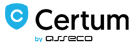

## Stake holder analysis
OptiKey uses a Low cost certificate for Open Source projects from www.certum.eu wich is one of the main resource available for quick and low cost for a customers production key and certificat . 

<!-- -->

OptiKey is allso guided by MSDN user guide and followed by the Microsoft standrats for developing and deployment by .Net framework 4.5 followed by the link attached here :
[MSDN developer deployment guide](http://msdn.microsoft.com/en-us/library/ee942965%28v=vs.110%29.aspx)

Hardware list for QA and testing performance/development has been assambled by a list of requirements for their project . followed by the idead to test with Low cost tablets and laptops.
[Hardware List](https://github.com/OptiKey/OptiKey/blob/master/docs/Low%20cost%20tablets%20and%20laptops.txt)

**Posts, issues, Bugs**

* Posts
  * [Meet OptiKey](https://framasphere.
org/camo/4989e8b43d52ac14e0783c8d5e56299ab8441fbf/687474703a2f2f33382e6d656469612e74756d62
6c722e636f6d2f66646639656361666639373863333535613135333233626161623435363336322f74756d626
c725f6e766c39346446635261317263377a6c316f315f3534302e676966)
  * [The Story of OptiKey](https://www.patreon.com/OptiKey?ty=h)
  * [milq](https://milq.com/tag/Optikey)
  * [OptiKey - Open Source Assistive Tech for Motor Neuron Disease](http://hanselminutes.com/502/optikey-open-source-assistive-tech-for-motor-neuron-disease)
  * [When vision becomes verbal](http://www.lawtechnologytoday.org/2015/10/vision-optikey)
* Bugs & issue
  * [Documented Bugs and issues and github](https://github.com/OptiKey/OptiKey/issues)
